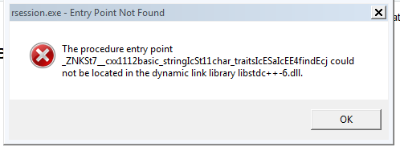

```{r setup, include=FALSE}
knitr::opts_chunk$set(echo = TRUE)
```

## Introduction

Whatever system you use, you need to install Julia.

Go to https://julialang.org/downloads and choose the correct download,
and install as appropriate. On JN's Windows 7 Virtual Machine under
VirtualBox, AVG antivirus (Free version) had to be disabled (protection
turned off) to enable install, which was to 
C:\Users\john\AppData\Local\Julia-0.6.4. In the bin\ subdirectory, there
is julia.exe and this can be run in a terminal, or double-clicked to open.
Julia runs, and can be terminated by `exit()` or `quit()`. Remember to 
re-enable antivirus. 

Note that later we will probably need to adjust some or other PATH variables, and
possibly set up links to ensure **R** can find Julia.

To get Julia to start in R, C:\Users\john\AppData\Local\Julia-0.6.4\bin needs
to be in the PATH. Then a CMD box will start Julia with the command `julia`.
However, after require(autodiffr), the ad_setup() call gives an error

Julia version 0.6.4 at location C:\Users\john\AppData\Local\JULIA-~1.4\bin will be used.
Error in juliacall_initialize(.julia$dll_file) : 
  C:\Users\john\AppData\Local\JULIA-~1.4\bin\libjulia.dll - The specified procedure could not be found.

Thus for Windows, there must be another setting somewhere needed.

May be due to R 3.4.4??

### Linux

?? need to check path

?? symlink

`autodiffr` can  be installed by:

```{r, eval=FALSE}
devtools::install_github("Non-Contradiction/autodiffr")
```

It's also recommended to install the latest version of `JuliaCall` by:

```{r, eval=FALSE}
devtools::install_github("Non-Contradiction/JuliaCall")
```

And after the installation is finished, just do the following steps,
note that the first time it will take some time, but the next time it should be better.

Julia.exe is in C:\Users\john\AppData\Local\Julia-0.6.4 after installation
( 32 bit -- the extra steps were not necessary as far as I can tell)
C:\Users\john\AppData\Local\Julia-0.6.4\bin was added to the PATH.

CMD box then runs julia fine.


```{r}
library(autodiffr)
ad_setup()
```

Error in juliacall_initialize(.julia$dll_file) : C:\Users\john\AppData\Local\JULIA-~1.4\bin\libjulia.dll - The specified procedure could not be found.

There is a msg box that gives the entry point that could not be found, with 
a reference to libstdc++-6.dll

```{r myscrshot, echo=FALSE, fig.cap="ErrBox", out.width = '100%'}

```

On Linux ... ??

On Macintosh (which OS??) ...


## Testing `autodiffr`


And we can use package `numDeriv` to compare with `autodiffr`.

```{r}
require(numDeriv)
```

## Direct wrapper functions of `ForwardDiff` and `ReverseDiff`

### Basic usage

In this section, we are using a function similar to Rosenbrock function as an initial example:

```{r}
## Later on, I may export these functions maybe in an R environment including all testing functions.
## So users can get easy access to these functions for examples, testing and benchmarking purposes.
## But currently these functions are unexported in autodiffr
rosen1 <- autodiffr:::rosenbrock_1
# And there are other functions, which can be used to replace the rosen1 function in the following examples like
# rosen2 <- autodiffr:::rosenbrock_2
# rosen4 <- autodiffr:::rosenbrock_4
# ackley <- autodiffr:::ackley

rosen1
# rosen2
# rosen4
# ackley

target <- rosen1
```

These functions receive a vector input and generates scalar output.
So `forward_grad` and `reverse_grad` can be used to calculate their gradients and `forward_hessian` and `reverse_hessian` can be used to calculate their hessians. Besides, it should be possible to calculate the jacobian of the gradient function, which should be the same with the hessian.

The basic usage is as follows:

```{r}
X <- runif(5)
X

forward_grad(target, X)

reverse_grad(target, X)

forward_jacobian(function(x) forward_grad(target, x), X)

reverse_jacobian(function(x) reverse_grad(target, x), X)

forward_hessian(target, X)

reverse_hessian(target, X)
```

And we can compare the results with `numDeriv`:

```{r}
numDeriv::grad(target, X)

numDeriv::jacobian(function(x) numDeriv::grad(target, x), X)

numDeriv::hessian(target, X)
```

We can see the result is similar, and results from `autodiffr` should be more accurate.

### Creating a function for the gradient

```{r}
grosen <- autodiffr::grad(target)
grosen
grosen(X)
## use in optimization
library(optimx)
x0<-c(-1.2, 1)
target(x0)
grosen(x0)
srosen0 <- optimr(x0, target, grosen, method="Rvmmin", control=list(trace=1))
srosen0
```


### Advance usage

#### Use of config object

If gradient or hessian of the same target function need to be caculated repeatedly on inputs of the same shape, like input vectors of same length or input matrices with the same number of rows and columns, then users can caculate config objects before to improve the performance:

```{r}
cfg <- forward_grad_config(target, X)
forward_grad(target, X, cfg = cfg)

cfg <- reverse_grad_config(X)
reverse_grad(target, X, cfg = cfg)

cfg <- forward_hessian_config(target, X)
forward_hessian(target, X, cfg = cfg)

cfg <- reverse_hessian_config(X)
reverse_hessian(target, X, cfg = cfg)
```

And users can also choose a chunk size when using config objects for forward mode automatic differentiation, choosing appropriate sample size can improve performance further.

```{r}
cfg1 <- forward_grad_config(target, X, chunk_size = 1)
forward_grad(target, X, cfg = cfg1)

cfg1 <- forward_hessian_config(target, X, chunk_size = 1)
forward_hessian(target, X, cfg = cfg1)
```

#### Use of tape object in reverse mode automatic differentiation

In reverse mode automatic differentiation, if the target function are defined without any branching, like `if`, `ifelse`, `while` and etc, then it is possible to use `tape` to further improve performance:

```{r}
tp <- reverse_grad_tape(target, X)
reverse_grad(tp, X)

tp <- reverse_hessian_tape(target, X)
reverse_hessian(tp, X)
```

## User interface functions provided by `autodiffr`

`autodiffr` provides a set of user interface functions to deal with the usage of forward and reverse mode automatic differentiation.

### Basic usage

If users want to caculate the gradient, hessian or jacobian directly:

```{r}
autodiffr::grad(target, X, mode = "forward")

autodiffr::grad(target, X, mode = "reverse")

autodiffr::hessian(target, X, mode = "forward")

autodiffr::hessian(target, X, mode = "reverse")
```

It's easy to have a gradient, hessian, or jacobian function just by ommiting the `x` argument:

```{r}
autodiffr::grad(target, mode = "forward")(X)

autodiffr::grad(target, mode = "reverse")(X)

autodiffr::hessian(target, mode = "forward")(X)

autodiffr::hessian(target, mode = "reverse")(X)
```

### Advanced usage

If users want to have a gradient, hessian, or jacobian function specalised for inputs of the fixed shape (like length of the input vector or numbers of rows and columns of the input matrix), 
then it is possible to have an optimized function by providing `xsize` argument:

```{r}
g1 <- autodiffr::grad(target, mode = "forward", xsize = runif(length(X)))
g1(X)

g2 <- autodiffr::grad(target, mode = "reverse", xsize = runif(length(X)))
g2(X)

h1 <- autodiffr::hessian(target, mode = "forward", xsize = runif(length(X)))
h1(X)

h2 <- autodiffr::hessian(target, mode = "reverse", xsize = runif(length(X)))
h2(X)
```

Beyond the `xsize` argument, users can also provide `chunk_size` for forward mode automatic differentiation.
From `?ForwardDiff` users can see instrustions on how to choose chunk size.
And users can use `use_tape` for reverse mode automatic differentiation, which may increase the performance of gradient, hessian or jacobian functions a lot.

```{r}
g1 <- autodiffr::grad(target, mode = "forward", xsize = runif(length(X)), chunk_size = 1)
g1(X)

g2 <- autodiffr::grad(target, mode = "reverse", xsize = runif(length(X)), use_tape = TRUE)
g2(X)

h1 <- autodiffr::hessian(target, mode = "forward", xsize = runif(length(X)), chunk_size = 1)
h1(X)

h2 <- autodiffr::hessian(target, mode = "reverse", xsize = runif(length(X)), use_tape = TRUE)
h2(X)
```

But please note that if the target function are defined with branching, like `if`, `ifelse`, `while` and etc, then `use_tape` may give incorrect results, like the following example.

```{r}
f <- function(x){
    if (x[1] > 1.5) {
        sum(x^2)
    }
    else {
        sum(x^3)
    }
}

gF <- autodiffr::grad(f, mode = "forward", xsize = rep(2,3), chunk_size = 1)

gR <- autodiffr::grad(f, mode = "reverse", xsize = rep(2,3), use_tape = TRUE)

gF(rep(1,3)) ## correct result

gR(rep(1,3)) ## wrong result
```
