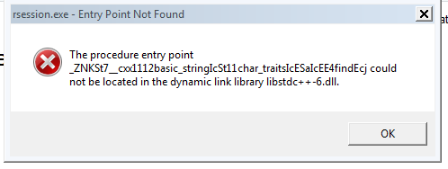

```{r setup, include=FALSE}
knitr::opts_chunk$set(echo = TRUE)
```

## Introduction

Whatever system you use, you need to install Julia.

Go to https://julialang.org/downloads and choose the correct download,
and install as appropriate. On JN's Windows 7 Virtual Machine under
VirtualBox, AVG antivirus (Free version) had to be disabled (protection
turned off) to enable install, which was to 
`C:\Users\john\AppData\Local\Julia-0.6.4`. In the `bin\` subdirectory, there
is julia.exe and this can be run in a terminal, or double-clicked to open.
Julia runs, and can be terminated by `exit()` or `quit()`. Remember to 
re-enable antivirus. 

Note that later we will probably need to adjust some or other PATH variables, and
possibly set up links to ensure **R** can find Julia.

To get Julia to start in R, `C:\Users\john\AppData\Local\Julia-0.6.4\bin` needs
to be in the PATH. Then a CMD box will start Julia with the command `julia`.
However, after require(autodiffr), the ad_setup() call gives an error

```
Julia version 0.6.4 at location 
C:\Users\john\AppData\Local\JULIA-~1.4\bin will be used.
Error in juliacall_initialize(.julia$dll_file) : 
  C:\Users\john\AppData\Local\JULIA-~1.4\bin\libjulia.dll 
  - The specified procedure could not be found.
```

Thus for Windows, there must be another setting somewhere needed.

May be due to R 3.4.4??

## Linux

?? need to check path

?? symlink

`autodiffr` can  be installed by:

```{r, eval=FALSE}
devtools::install_github("Non-Contradiction/autodiffr")
```

It's also recommended to install the latest version of `JuliaCall` by:

```{r, eval=FALSE}
devtools::install_github("Non-Contradiction/JuliaCall")
```

And after the installation is finished, just do the following steps,
note that the first time it will take some time, but the next time it should be better.

Julia.exe is in `C:\Users\john\AppData\Local\Julia-0.6.4` after installation
( 32 bit -- the extra steps were not necessary as far as I can tell)
`C:\Users\john\AppData\Local\Julia-0.6.4\bin` was added to the PATH.

CMD box then runs julia fine.


```{r, eval=FALSE}
library(autodiffr)
ad_setup()
```

```
Error in juliacall_initialize(.julia$dll_file) : 
C:\Users\john\AppData\Local\JULIA-~1.4\bin\libjulia.dll 
- The specified procedure could not be found.
```

There is a msg box that gives the entry point that could not be found, with 
a reference to libstdc++-6.dll

```{r myscrshot, echo=FALSE, fig.cap="ErrBox", out.width = '100%'}

```

On Linux ... ??


## Macintosh

??? which version


## Windows

### Windows 10 

Asus UX303 -- worked. What were steps?

### Windows 7 - 64 bit

Asus EEE 1225B


### Windows 7 - 32 bit

Tried on VM, but did not get satisfactory outcome. 


## Testing the `autodiffr` installation

And we can use package `numDeriv` to compare with `autodiffr`.

```{r}
require(numDeriv)
```

